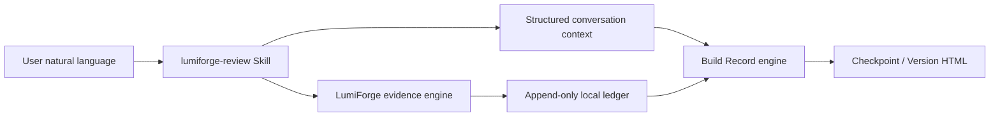

# Architecture

## Product boundary

LumiForge is Skill-first and local-first.



- The Skill chooses checkpoint or finalize mode and structures the visible conversation.
- The CLI is a machine-facing transport, not the primary product surface.
- The evidence engine captures observable facts.
- The Build Record engine creates version-scoped, human-readable artifacts.

## Core objects

### Project

A stable local identity stored in `.lumiforge/project.json`. It is the cross-conversation memory boundary.

### Project Run

An optional recording window with repeatable pause and resume periods. Runs control capture time; they do not define product versions.

### Evidence Event

An append-only observable fact such as a visible message, tool call, file diff, command result, or lifecycle event.

### Change Episode

A derived chain connecting trigger, visible approach, code changes, verification, and outcome.

### Build Record

A checkpoint containing Agent-prepared context plus only the evidence not already assigned to an earlier checkpoint.

### Version

An explicit user-owned completion boundary. Finalization aggregates only checkpoints and unassigned evidence from the active version, seals it, and starts a fresh boundary for future work.

## Storage

```text
.lumiforge/
├── project.json
├── events.jsonl
├── runs/
└── artifacts/project_review.html

build-history/
├── manifest.json
├── index.html
├── checkpoints/<record-id>/
└── releases/<version>/
```

Raw evidence and generated reports are excluded from Git by default because both can contain private project context.

## Trust model

LumiForge distinguishes:

- Direct evidence: diffs, commands, test results, visible messages, and tool calls.
- Derived interpretation: Change Episode grouping and Agent-prepared summaries.
- User authority: only the user may declare a version complete.

The system never claims access to hidden model reasoning. Failed and unverified states remain visible.

## Current constraints

- Codex and Claude Code local history formats may change.
- Build Records are local and single-user.
- Episode relationships are conservative suggestions.
- The System Map reflects observed files, not a complete architecture audit.
- There is no cloud synchronization or team access control.
