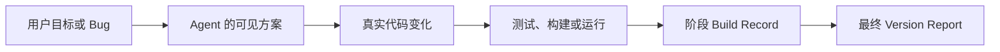

# LumiForge

LumiForge 把 Coding Agent 在多次对话中完成的工程工作，整理成有证据的阶段记录和版本报告。

它不把“文件修改了几次”当作工程过程。它连接的是：



## Skill-first

LumiForge 的主要入口是 `lumiforge-review` Skill。用户只需要对 Agent 说：

> 用 LumiForge 整理当前对话。这个版本还没有完成。

Skill 会生成阶段记录。如果当前版本已经完成，可以说：

> 用 LumiForge 汇总这个项目。当前版本已经完成，版本号是 v0.3。

用户不需要操作终端。CLI 仍然保留，但只作为 Skill 的确定性基础设施和开发者接口。

## 两种记录

### 阶段记录

阶段记录保存当前对话和自上次记录以来新增的工程证据：

```text
build-history/checkpoints/2026-06-21-001/
├── record.json
├── summary.md
├── evidence.json
└── report.html
```

### 版本报告

当用户明确确认当前版本完成后，LumiForge 会聚合当前版本的阶段记录并封存版本边界：

```text
build-history/releases/v0.3/
├── record.json
├── summary.md
├── evidence.json
└── report.html
```

下一次阶段记录会自动进入新版本，不会污染已经完成的版本报告。

## 报告内容

- 当前目标和阶段结论
- 用户遇到的问题
- Agent 采用的可见解决方式
- 真实文件 Diff 和工具调用
- 测试、构建和运行结果
- 已验证、失败和未验证状态
- 关键决策及其理由
- 尚未完成的事项和下一步
- 跨对话的 Change Episodes

报告是自包含 HTML，可以离线打开，并提供 `Overview`、`Journey`、`System Map` 和 `Evidence` 四个视图。

## 安装

非技术用户可以直接把仓库地址交给 Coding Agent：

> 请从 https://github.com/lumihelia/LumiForge 安装 LumiForge 和它的 lumiforge-review Skill。

项目维护者或 Coding Agent 在仓库根目录运行一次：

```bash
python3 scripts/setup.py
python3 scripts/install_skill.py
```

第二条命令会把 Skill 安装到当前用户的 Codex Skills 目录。安装后如果没有立即出现，重新启动 Codex。

验证安装：

```bash
python3 skills/lumiforge-review/scripts/run_lumiforge.py --version
```

## 开发者 CLI

Skill 在后台调用以下机器接口：

```bash
lumiforge checkpoint --context-file context.json --json-output
lumiforge finalize --version v0.3 --context-file context.json --json-output
```

持续记录和手动证据命令仍然可用：

```text
lumiforge init       创建项目身份
lumiforge start      开始后台记录
lumiforge pause      暂停记录
lumiforge resume     恢复记录
lumiforge close      结束一次 Project Run
lumiforge sync       导入项目相关的 Codex / Claude Code 对话
lumiforge note       手动补充目标、问题、决策或结果
lumiforge verify     执行验证命令并保存输出
lumiforge review     生成整个项目的观察报告
```

完整命令说明见 [USAGE.md](USAGE.md)。

## 数据边界

- `.lumiforge/` 保存本地原始证据，不应公开。
- `build-history/` 保存可读报告，但仍可能包含对话、Diff、路径和命令输出。
- `.env`、私钥和常见凭证文件不会捕获内容。
- LumiForge 只记录 Agent 明确输出和可观察行为，不声称知道模型隐藏推理。

`build-history/` 默认被 Git 忽略。分享报告前必须人工检查。完整说明见 [SECURITY.md](SECURITY.md)。

## 当前阶段

`v0.3.0` 是本地单用户 Alpha MVP。当前重点是验证一个产品指标：同一个 Bug 跨越多个 Agent 对话后，最终报告能否可信地展示它从发现、修改到验证的完整路径。

暂不支持云同步、团队权限、多用户协作或自动判断“产品已经完成”。版本完成必须由用户明确确认。

## 开发验证

```bash
PYTHONDONTWRITEBYTECODE=1 venv/bin/python -m unittest discover -s tests -v
```

## License

[MIT](LICENSE)
