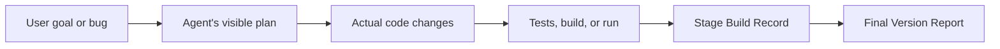

**English** | [简体中文](README.zh-CN.md)

# LumiForge

LumiForge turns the engineering work a coding agent does across multiple conversations into evidence-backed checkpoint records and version reports.

It doesn't treat "how many times a file changed" as the engineering process. What it actually tracks is:



## Skill-first

LumiForge's main entry point is the `lumiforge-review` Skill. The user just tells the agent:

> Use LumiForge to record this conversation. This version isn't finished yet.

The Skill generates a checkpoint record. Once the current version is actually done, the user can say:

> Use LumiForge to wrap up this project. This version is complete — call it v0.3.

The user never has to touch a terminal. The CLI is still there, but only as the Skill's deterministic infrastructure and a developer-facing interface.

## Two kinds of records

### Checkpoint records

A checkpoint record captures the current conversation plus any engineering evidence added since the last checkpoint:

```text
build-history/checkpoints/2026-06-21-001/
├── record.json
├── summary.md
├── evidence.json
└── report.html
```

### Version reports

Once the user explicitly confirms a version is complete, LumiForge rolls up that version's checkpoint records and seals the version boundary:

```text
build-history/releases/v0.3/
├── record.json
├── summary.md
├── evidence.json
└── report.html
```

The next checkpoint automatically starts a new version, so it never bleeds into a version report that's already been finalized.

## What's in a report

- The current goal and where this stage landed
- Problems the user ran into
- The visible fix the agent applied
- Real file diffs and tool calls
- Test, build, and run results
- What's verified, what failed, and what's still unverified
- Key decisions and the reasoning behind them
- What's still unfinished, and what's next
- Change Episodes that span multiple conversations

The report is a self-contained HTML file you can open offline, with four views: `Overview`, `Journey`, `System Map`, and `Evidence`.

## Installation

A non-technical user can just hand the repo URL to a coding agent:

> Please install LumiForge and its lumiforge-review Skill from https://github.com/lumihelia/LumiForge.

Project maintainers or coding agents should run this once from the repo root:

```bash
python3 scripts/setup.py
python3 scripts/install_skill.py
```

The second command installs the Skill into the current user's Codex Skills directory. If it doesn't show up right away, restart Codex.

Verify the install:

```bash
python3 skills/lumiforge-review/scripts/run_lumiforge.py --version
```

## Developer CLI

Under the hood, the Skill calls these machine-facing commands:

```bash
lumiforge checkpoint --context-file context.json --json-output
lumiforge finalize --version v0.3 --context-file context.json --json-output
```

Continuous recording and manual evidence commands are still available:

```text
lumiforge init       create a project identity
lumiforge start      start background recording
lumiforge pause      pause recording
lumiforge resume     resume recording
lumiforge close      end a Project Run
lumiforge sync       import related Codex / Claude Code conversations
lumiforge note       manually add a goal, problem, decision, or result
lumiforge verify     run a verification command and save its output
lumiforge review     generate an observation report for the whole project
```

See [USAGE.md](USAGE.md) for the full command reference.

## Data boundaries

- `.lumiforge/` holds raw local evidence and should not be made public.
- `build-history/` holds human-readable reports, but these can still contain conversation text, diffs, paths, and command output.
- `.env` files, private keys, and common credential files are never captured.
- LumiForge only records what the agent explicitly outputs and observable behavior — it doesn't claim to know a model's hidden reasoning.

`build-history/` is Git-ignored by default. Review any report by hand before sharing it. Full details in [SECURITY.md](SECURITY.md).

## Current stage

`v0.3.0` is a local, single-user Alpha MVP. The current focus is validating one product claim: when the same bug spans multiple agent conversations, can the final report credibly show its full path — from discovery, through the fix, to verification?

There's no cloud sync, team permissions, multi-user collaboration, or automatic detection of "the product is done" yet. A version is only complete when the user explicitly says so.

## Development verification

```bash
PYTHONDONTWRITEBYTECODE=1 venv/bin/python -m unittest discover -s tests -v
```

## License

[MIT](LICENSE)
